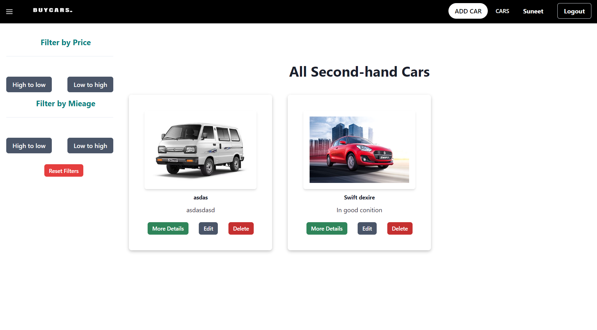
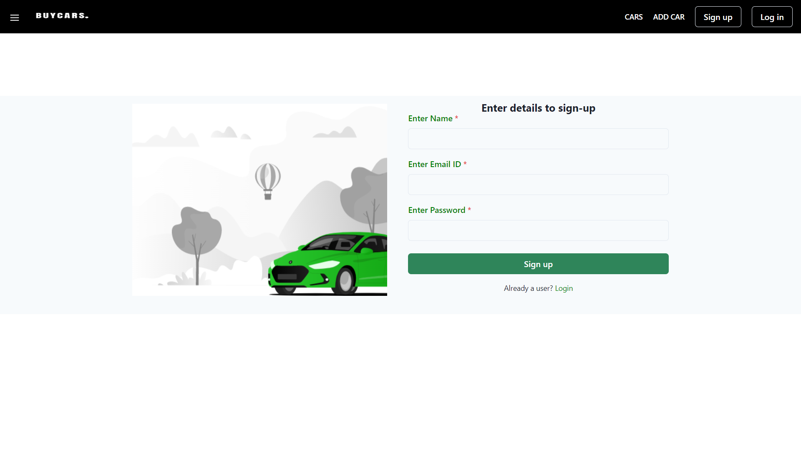
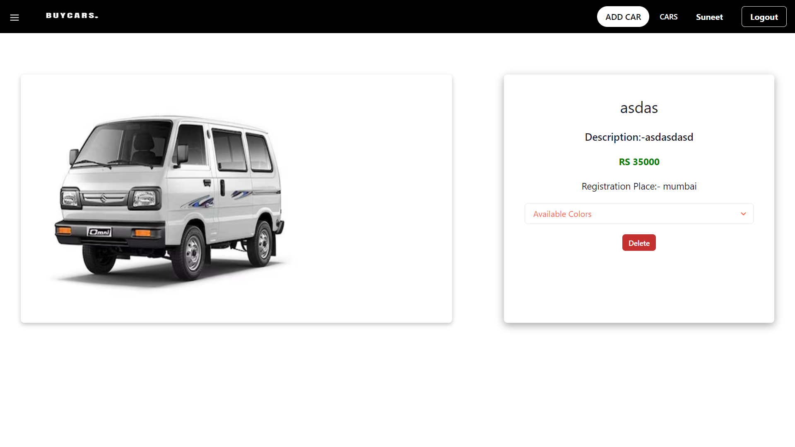
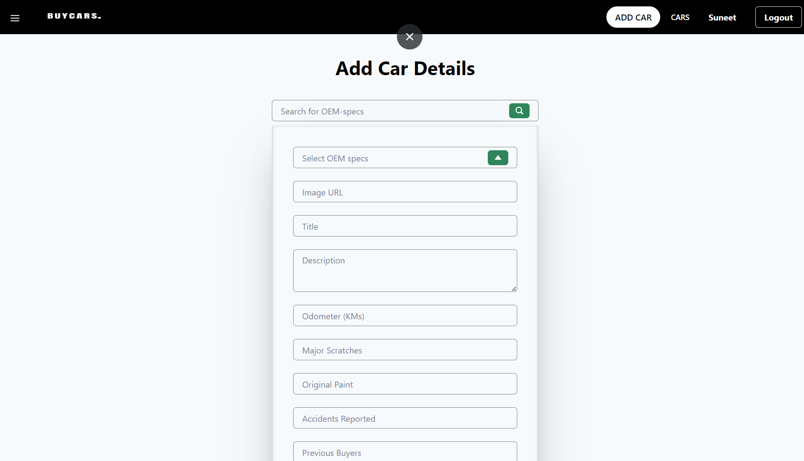
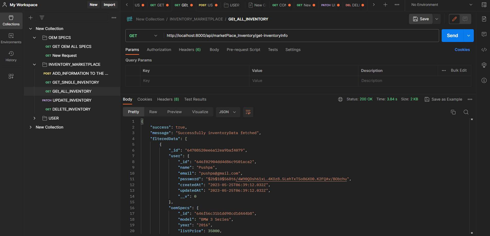

## Working on Buyrs.com....

<h1>Landing Page</h1>
 

 

<h1>Signup Page</h1>
 

 
<h1>Cars Page</h1>
 

 

<h1>Single Car Page</h1>
 

 

<h1>Add Car Page</h1>
 

 

<h1>Backend [POSTMAN]</h1>
 

 

<h1>BUYC Corp is a marketplace for second-hand cars. Dealers list their inventory of second-hand cars on buycars.com. Buyers can look at the inventory and buy the car from buycars.com.</h1>

<h1>Build with</h1>

<ul>

<li>HTML</li>
<li>CSS</li>
<li>Javascript (ES6)</li>
<li>Chakra UI</li>
<li>Redux UI</li>
<li>Mongodb UI</li>
<li>Express</li>
<li>React.js</li>
<li>React Routing</li>
<li>node js</li>

</ul>
<h1>By Suneet Panigrahi</h1>